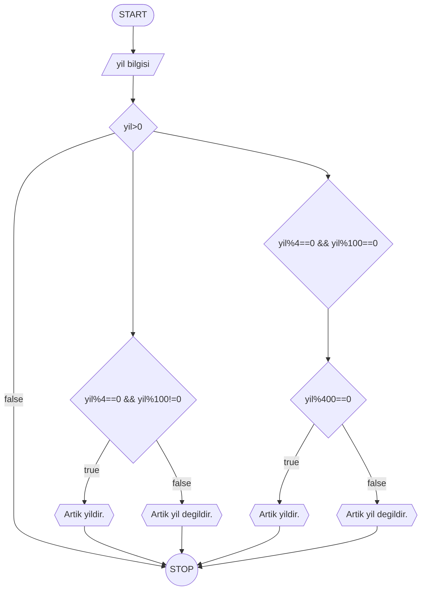

## Artık yıl bulma programı 
### Akış diyagramı

```mermaid
flowchart TD
     A([START])-->B[/yil/] 
     Z{yil>0}-->C{yil%4==0 && yil%100==0}
     Z{yil>0}-->D{yil%4==0 && yil%100!=0}
     B[/yil bilgisi/]--> Z{yil>0}
     Z{yil>0} -->|false|K((STOP))
     C{yil%4==0 && yil%100==0} --> X{yil%400==0}
     D{yil%4==0 && yil%100!=0} -->|true|E{{Artik yildir.}}
     D{yil%4==0 && yil%100!=0} -->|false|F{{Artik yil degildir.}}
     X{yil%400==0} -->|true|G{{Artik yildir.}}
     X{yil%400==0} -->|false|H{{Artik yil degildir.}}
     E{{Artik yildir.}} --> K((DUR))
     F{{Artik yil degildir.}} --> K((STOP))
     G{{Artik yildir.}} -->K((STOP))
     H{{Artik yil degildir.}} -->K((STOP))
```